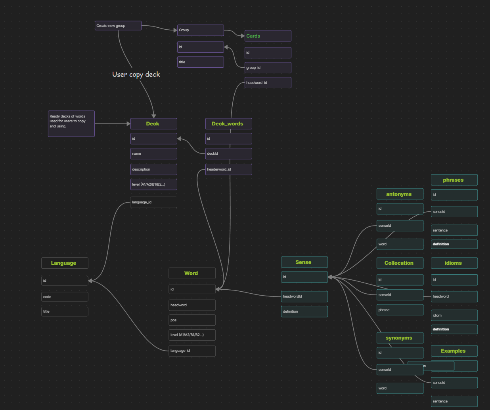

## Database

Database is contains user info: 
- cards
- groups
- sections
- sharedGroups

And Database contains headwords, collocations, examples for best learning.

It should look like this


Database will contain data of words, with bunch of stuff. Also decks will be generated by app, so user can import them.

## Database HeadWords
The most important problems to solve are:
* How to save these words in database in render.com

### Saving
The most efficient way to save data somewhere for database is raw sql seeds.

Next steps are:
 Don’t try to dump thousands of words at once. Here’s a strict, step-by-step approach.

---

# **1. Decide your data structure**

Each word has:

* `headerwords` (main word)
* `senses` (meanings)
* `examples` (sentences)
* `idioms`, `synonyms`, `antonyms`, `phrases` (optional at start)

A deck connects to words via `deck_words`.

You need to **reflect this in SQL**.

---

# **2. Create folder structure for seeds**

```
/db
   /seeds
       001_headerwords.sql
       002_senses.sql
       003_examples.sql
       004_decks.sql
       005_deck_words.sql
```

* Numbering ensures execution order.
* Each file is **one table only**, no mixed inserts.

---

# **3. How to generate SQL inserts**

There are 3 practical ways:

---

### **Option A — Manual generation (small datasets, 100 words)**

Create a CSV or JSON:

```json
[
  { "id": "hw1", "word": "book", "language_id": "en" },
  { "id": "hw2", "word": "apple", "language_id": "en" }
]
```

Then convert to SQL:

```sql
INSERT INTO headerwords (id, word, language_id) VALUES
('hw1', 'book', 'en'),
('hw2', 'apple', 'en');
```

For 100 words, this is fine. You can do it manually or via a small script.

---

### **Option B — Script generation (better for 1k–10k words)**

Use Node.js:

```ts
import fs from "fs";

const words = JSON.parse(fs.readFileSync("./data/words.json", "utf-8"));

const sql = `INSERT INTO headerwords (id, word, language_id) VALUES
${words.map(w => `('${w.id}', '${w.word}', '${w.language_id}')`).join(",\n")};`;

fs.writeFileSync("./db/seeds/001_headerwords.sql", sql);
```

Repeat for `senses`, `examples`, `deck_words`, etc.

This gives you **clean, repeatable seed files**.

---

### **Option C — Use a database GUI or Excel**

* Fill your CSV with word data
* Export as SQL INSERT statements
* Save in `/db/seeds`

Good for first 100 words.

---

# **4. How to execute on Render**

1. Commit `/db/seeds` to repo.
2. Connect to your Render Postgres via `psql` CLI:

```bash
psql -h <host> -U <user> -d <database> -f db/seeds/001_headerwords.sql
psql -h <host> -U <user> -d <database> -f db/seeds/002_senses.sql
...
```

3. Done. Your tables are populated.
4. Next deploy → do **not rerun seeds**, or add `ON CONFLICT DO NOTHING`.

---

# **5. Best practice for future expansion**

* Keep a **master JSON** as your source of truth.
* Auto-generate seeds from it.
* Use **versioned seeds** (`001_`, `002_` …).
* For updates: either create a **new seed** or write `UPDATE` statements.

This way, you can go from 100 → 1000 → 10k words **without breaking anything**.

---

If you want, I can write a **ready-to-use Node.js script** that takes your 100-word JSON and generates **all SQL seeds** for `headerwords`, `senses`, `examples`, and `deck_words`.
It will save you tons of manual work. Do you want me to do that?

